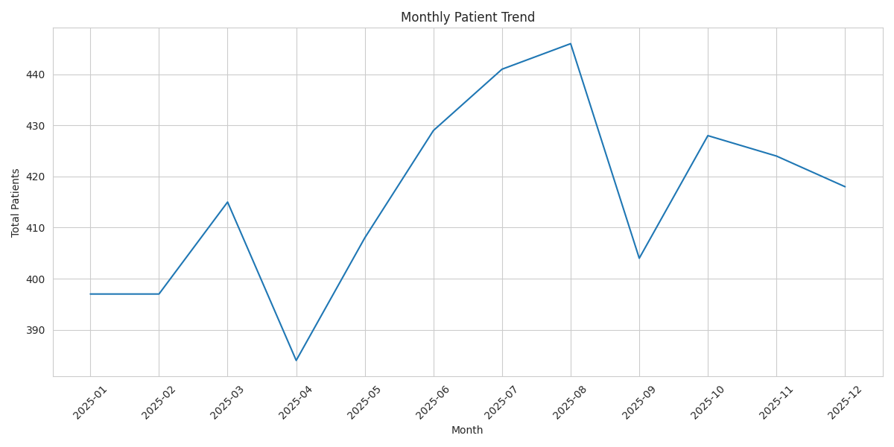
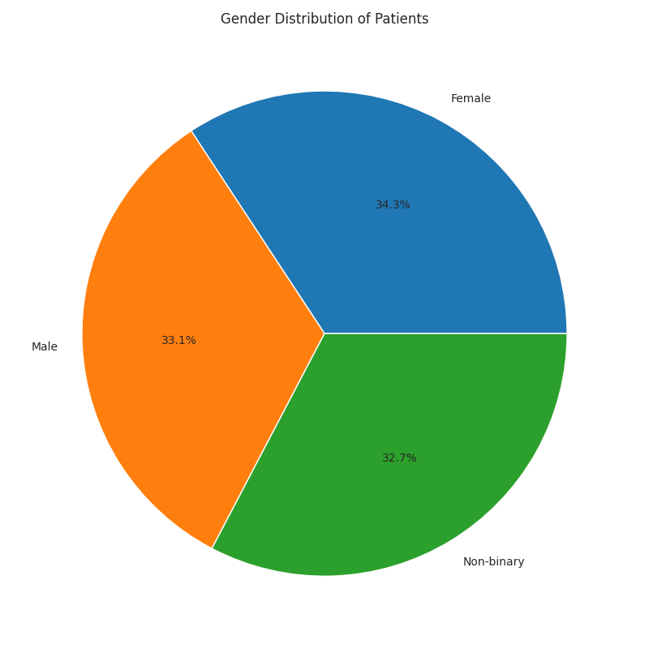
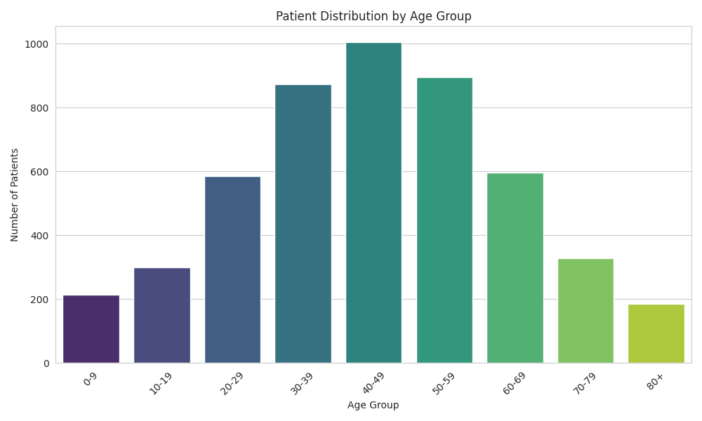
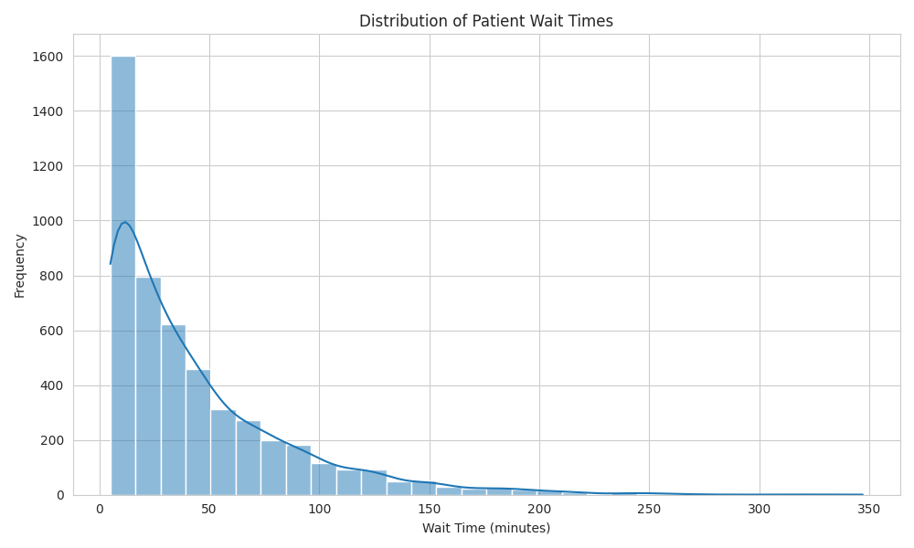
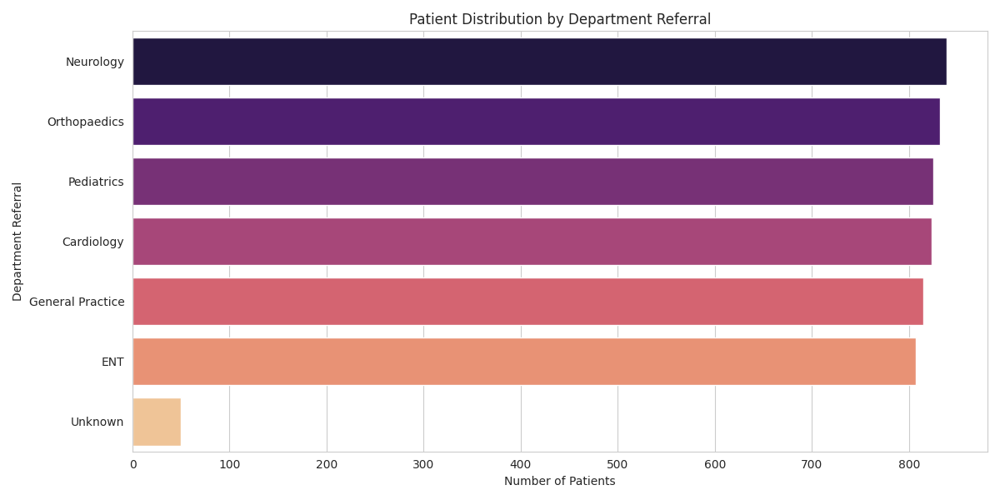
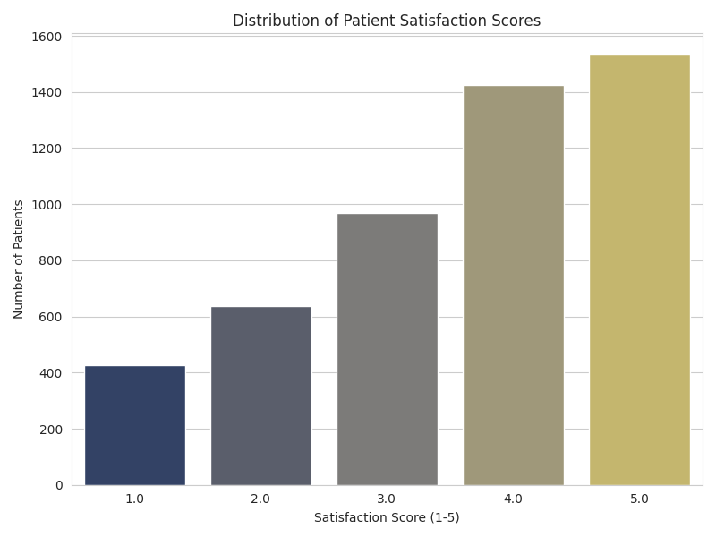

# Hospital Emergency Room Analytics Project

## Project Overview
This project presents a comprehensive analytics solution for a Hospital Emergency Room (ER), designed to provide actionable insights into operational efficiency, patient experience, and resource management. Leveraging a synthetic dataset, this end-to-end project demonstrates data cleaning, feature engineering, data modeling, DAX measure creation, and dashboard design principles.

## Tools Used
*   **Data Generation & Cleaning:** Python (Pandas, NumPy)
*   **Data Modeling:** Star Schema principles
*   **Data Analysis Expressions (DAX):** For advanced calculations in Power BI
*   **Visualization & Dashboarding:** Python (Matplotlib, Seaborn) & Power BI Design
*   **Documentation:** Markdown

## Dataset
The project utilizes a synthetic dataset representing Hospital Emergency Room data. Key columns include Patient ID, Admission Date/Time, Gender, Age, Race, Department Referral, Satisfaction Score, and Wait Time.

## Dashboard & Visualizations
Yahan aapke project ke main graphs hain:

### 1. Monthly Patient Trend

### 2. Patient Demographics (Gender & Age)

### 3. Operational Analysis (Wait Time & Departments)

### 4. Patient Satisfaction

## Key Insights
*   **Peak Hours:** Identified 8 AM - 11 AM and 5 PM - 8 PM as high-pressure periods.
*   **Wait Time Correlation:** Longer wait times directly lead to lower satisfaction scores.
*   **Department Load:** General Practice and Pediatrics handle the highest volume of referrals.

## Business Impact
*   **Optimized Staffing:** Data-driven staffing recommendations for peak hours.
*   **Efficiency:** Improved patient flow by identifying bottlenecks in specific departments.
*   **Patient Care:** Enhanced satisfaction by monitoring and reducing wait time delays.

## Future Improvements
*   Integrate real-time data sources.
*   Implement Machine Learning for predicting patient inflow.
